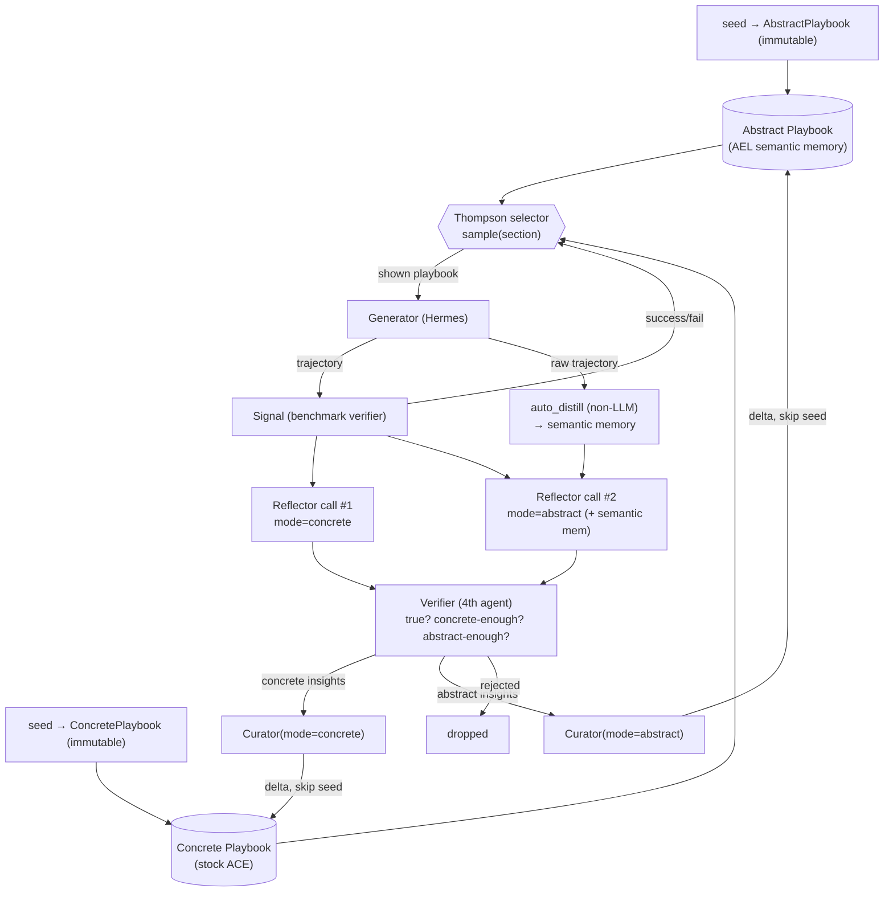

# Self-Improving Feedback Loop — Simplified Spec (dual-playbook, 4-agent)

An abstraction-split, verifier-gated feedback loop for Hermes Agent, built **on top of the
real ACE codebase** (`github.com/ace-agent/ace`) with ideas from **AEL** (semantic memory +
Thompson selection) and **EDV** (verify-before-commit). Written so Claude Code can implement it
directly: every change is mapped to an actual ACE file and insertion point (§11).

## Sources → what we take

| Source | Idea taken | Becomes |
|---|---|---|
| **ACE** (`ace-agent/ace`) | Generator/Reflector/Curator loop, itemized playbook, delta apply, FAISS dedup | the **concrete playbook** + the loop skeleton |
| **AEL** (arXiv 2604.21725) | "semantic memory" (cross-episode abstract patterns) + `auto_distill` (non-LLM extraction) + fast-timescale **Thompson bandit** | the **abstract playbook** + the playbook **selector** |
| **EDV** (arXiv 2606.24428) | Verify-before-write, strict default-reject auditor | the **Verifier** (4th agent) |
| **ASSAY** | hand-written immutable operational templates | the **seeds** for both playbooks |

## What changes vs. stock ACE (5 changes)

Stock ACE = 3 agents (Generator → Reflector → Curator) over **one** playbook. We change:

1. **Two playbooks** — a **concrete** playbook (the stock ACE playbook) and an **abstract**
   playbook (AEL's semantic-memory idea), stored and edited independently.
2. **`auto_distill` (non-LLM)** extracts a *semantic memory* from the raw trajectory; this feeds
   the abstract side of reflection.
3. **The Reflector runs twice (two prompts, two API calls):** one concrete-flavored call → the
   concrete playbook; one abstract call that includes the `auto_distill` semantic memory → the
   abstract playbook.
4. **A 4th agent, the Verifier**, sits between Reflector and Curator: checks each insight is
   true to the trajectory and confirms it is concrete-enough / abstract-enough for its target
   playbook (else rejects).
5. **Thompson sampling** (AEL fast-timescale bandit) picks which of the two playbooks the
   Generator reads each task; **both** seeds are predefined and immutable.

Final agent set: **Generator, Reflector (×2 calls), Verifier, Curator (×≤2 calls)** + one
non-LLM `auto_distill`.

---

## 1. Grounding in the real ACE codebase (read first)

Actual ACE repo layout (`ace-agent/ace`, from `EXTENDING_ACE.md`):

```
ace/
├── core/
│   ├── generator.py          # Generator agent
│   ├── reflector.py          # Reflector agent
│   ├── curator.py            # Curator agent
│   └── bulletpoint_analyzer.py   # embedding de-dup (FAISS), toggled by use_bulletpoint_analyzer
├── prompts/{generator,reflector,curator}.py
├── ace.py                    # MAIN ORCHESTRATOR (the loop lives here)
playbook_utils.py             # playbook load/save/format operations
```

Stock orchestrator loop (`ace.py`, per task — confirmed from reference impls):

```python
gen_output  = generator.run(query, playbook)                 # Step 1
reflection  = reflector.run(query, gen_output, playbook)     # Step 2 -> should_learn + insights
if reflection.should_learn:
    delta_patch = curator.run(reflection, playbook)          # Step 3 -> DeltaPatch
    apply_deltas(playbook, delta_patch.deltas)               # deterministic apply
```

Stock schemas: `Bullet{id, section, content, metadata{helpful,harmful,timestamp,usage_count}}`,
`Delta{operation("add"|"update"|"remove"), target_id, content, reasoning}`,
`DeltaPatch{analysis, deltas, should_update}`. Playbook = itemized text with sections
(`[str-00001] helpful=5 harmful=0 :: ...`, `## STRATEGIES & INSIGHTS`, `## COMMON MISTAKES TO
AVOID`). Dedup via FAISS (`bulletpoint_analyzer.py`, 0.9, off by default). Config keys reused:
`playbook_token_budget` (80000), `curator_frequency` (1), `use_bulletpoint_analyzer`,
`initial_playbook_path`, `no_ground_truth`.

**Everything below is expressed as edits to these files.** The loop, schemas, and dedup are
reused; we add two stores, a selector, a non-LLM distiller, and a verifier, and split two
prompts / double one call.

---

## 2. Object model (two playbooks + semantic memory)

```
ConcretePlaybook : ACE playbook   # the stock ACE playbook: specific, situation-tied rules
AbstractPlaybook : ACE playbook   # AEL semantic-memory idea: cross-trajectory general patterns

Bullet (unchanged from ACE):
  id; section; content
  metadata: { helpful, harmful, timestamp, usage_count, protected:bool }
              # protected=true for seed bullets (never edited/removed)

SemanticMemory (NEW, transient per task — output of auto_distill; input to abstract Reflector):
  # non-LLM structured extraction from the raw trajectory (see §5)
  tool_usage; signal_correctness; recurring_patterns; outcome_summary   # domain-adaptable fields

SelectorState (NEW, persisted JSON next to playbooks):
  posteriors: { section: { "abstract":{a,b}, "concrete":{a,b} } }   # Beta(1,1) prior; "__default__" fallback
```

`helpful/harmful` are **per-bullet** (ACE-native, ranking/dedup within a playbook). Thompson
posteriors are **per-playbook** (which store helps the Generator). No promotion / compression /
linking / SectionProfile — the two playbooks are independent ACE stores; the Reflector's two
calls target them separately and the Verifier validates the fit.

---

## 3. Architecture flow (modified `ace.py` loop)

```python
# STEP 0  Thompson selects which playbook the Generator reads   [AEL bandit; playbook_selector.py]
arm            = selector.sample(section)                 # "abstract" | "concrete"
shown_pb       = abstract_pb if arm == "abstract" else concrete_pb
shown_context  = format_playbook(shown_pb, budget=playbook_token_budget)

# STEP 1  generate                                        [ace/core/generator.py, unchanged]
gen_output     = generator.run(query, shown_context)      # trajectory + final answer

# STEP 1.5 signal + Thompson update                        [benchmark verifier drives the bandit]
signal         = get_signal(task, gen_output)             # success | failure
selector.update(section, arm, signal)                     # Beta posterior update

# STEP 2  reflect  — auto_distill (0 LLM) + TWO reflector calls
semantic_mem   = auto_distill(gen_output.trajectory)                                   # [NEW, non-LLM]
refl_concrete  = reflector.run(query, gen_output, shown_context, mode="concrete")      # LLM call #1
refl_abstract  = reflector.run(query, gen_output, shown_context,
                               semantic_memory=semantic_mem, mode="abstract")          # LLM call #2

# STEP 2.5 VERIFY each stream (one call, default-reject)   [NEW: ace/core/verifier.py]
verified       = verifier.run(refl_concrete, refl_abstract,
                              gen_output.trajectory, abstract_pb, concrete_pb)
                 # -> { concrete:[accepted], abstract:[accepted] }, rejects dropped

# STEP 3  curate EACH playbook separately                  [ace/core/curator.py, two prompts]
if verified.concrete:
    dp_c = curator.run(verified.concrete, concrete_pb, mode="concrete")
    apply_deltas(concrete_pb, dp_c.deltas, respect_protected=True)
if verified.abstract:
    dp_a = curator.run(verified.abstract, abstract_pb, mode="abstract")
    apply_deltas(abstract_pb, dp_a.deltas, respect_protected=True)
```

The trajectory is produced with **one** playbook shown, but both playbooks learn every task
(concrete via reflector call #1, abstract via `auto_distill` → reflector call #2). Thompson
governs only *reading*.



---

## 4. Components → files

| # | Component | File | New/Edit | Role |
|---|---|---|---|---|
| M0 | Dual playbook + seed + protected | `playbook_utils.py` | Edit | manage two playbooks; load two seeds; `respect_protected`; persist SelectorState |
| M1 | **Playbook Selector (Thompson, AEL)** | `ace/core/playbook_selector.py` | **New** | `sample(section)->arm`; `update(section,arm,signal)` |
| M2 | Generator | `ace/core/generator.py` | none | unchanged; reads chosen playbook via `{playbook}` |
| M3 | Signal | harness | reuse | benchmark verifier → success/fail; drives Thompson |
| M3.5 | **auto_distill (AEL, non-LLM)** | `ace/core/auto_distill.py` | **New** | `auto_distill(trajectory)->SemanticMemory`, no LLM call |
| M4 | Reflector ×2 | `ace/core/reflector.py` + `ace/prompts/reflector.py` | Edit | add `mode`; two prompts (concrete / abstract+semantic); two API calls |
| M4.5 | **Verifier (4th agent, EDV)** | `ace/core/verifier.py` + `ace/prompts/verifier.py` | **New** | gate (true?) + confirm level-fit per stream; default-reject |
| M5 | Curator ×≤2 | `ace/core/curator.py` + `ace/prompts/curator.py` | Edit | add `mode`; two prompts; apply skips protected |
| M6 | Counters + dedup | `ace/core/bulletpoint_analyzer.py` | reuse | one FAISS index per playbook |
| M7 | Offline refine | orchestrator/cron | reuse | dedup + prune stale/harmful per playbook; seed exempt |

Three new files (`playbook_selector.py`, `auto_distill.py`, `verifier.py`), edited prompts
(`reflector.py`, `curator.py`), orchestrator wiring in `ace.py`.

---

## 5. M3.5 — auto_distill (AEL semantic memory, non-LLM)

New `ace/core/auto_distill.py`. AEL builds *semantic memory* by aggregating episodic records
into cross-episode patterns; the extraction from a raw trajectory is a **deterministic, non-LLM**
step. We run it per trajectory to produce the semantic-memory input for the abstract Reflector
call.

```
auto_distill(trajectory) -> SemanticMemory:
    # NO LLM CALL. Structured/programmatic extraction, e.g.:
    #  - tool_usage:        which tools/actions were called, counts, order
    #  - signal_correctness: which intermediate signals/checks passed or failed
    #  - recurring_patterns: repeated action/state motifs within the trajectory
    #  - outcome_summary:    final success/failure + where it turned
    # Return a compact structured record (dict) — the "semantic memory" for this episode.
```

Implementation note: follow AEL's episodic→semantic extraction (parse the trajectory's tool
calls, signals, correctness, outcome). Keep the fields domain-adaptable per benchmark. AEL also
aggregates semantic memory across episodes (periodically, every ~10); that cross-episode
aggregation is **optional** here — the per-trajectory `auto_distill` output feeding the abstract
Reflector is the required piece; a periodic aggregation pass can be added later (fits M7).

The `SemanticMemory` is transient (feeds reflection); the persisted abstract knowledge lives in
the **abstract playbook** after curation.

---

## 6. M4 — Reflector runs TWICE (concrete + abstract)

`reflector.run(...)` gains a `mode` param and is called twice per task with different prompts
and inputs (two API calls):

- **Call #1 — `mode="concrete"`** (`CONCRETE_REFLECTOR_PROMPT`): the stock ACE reflector prompt,
  tuned to produce **more concrete-flavored** insights (specific rules, exact APIs/params tied
  to this trajectory). Inputs: query, gen_output, shown_context. → candidate insights for the
  **concrete** playbook.
- **Call #2 — `mode="abstract"`** (`ABSTRACT_REFLECTOR_PROMPT`): a prompt that **includes the
  `auto_distill` semantic memory** and asks for **general, transferable patterns** in
  abstract-playbook form. Inputs: query, gen_output, shown_context, **semantic_memory**. →
  candidate insights for the **abstract** playbook.

Output schema is the stock structured reflection for each call; the two candidate sets are kept
separate (they carry an implicit target: concrete-call → concrete, abstract-call → abstract),
and the Verifier validates that target.

---

## 7. M4.5 — Verifier (4th agent, before Curator)

New `ace/core/verifier.py` + `ace/prompts/verifier.py`. One LLM call, **ideally a different
model** from the Reflector (EDV: same-model self-verification does not help). Adapted from EDV's
default-reject auditor.

```
verifier.run(refl_concrete, refl_abstract, trajectory, abstract_pb, concrete_pb)
    -> Verified{ concrete: [accepted], abstract: [accepted] }   # rejects dropped
```

Per insight, in order:
1. **Grounded / true to trajectory?** Supported by concrete trajectory evidence (steps, tool
   calls, outputs)? Hallucinated/unsupported → **reject**.
2. **Level-fit for its target playbook** (the user's core check):
   - concrete-stream insight → **concrete enough** to belong in the concrete playbook? (specific,
     situation-tied) else reject or drop.
   - abstract-stream insight → **abstract enough** to belong in the abstract playbook?
     (general, transferable) else reject or drop.
3. **Non-redundant** vs. existing bullets in the target playbook (read-only check).

Output strict JSON `{ "concrete":[...], "abstract":[...] }`. Reads both playbooks read-only; it
never mutates (mutation is Curator's job). **Placement before Curator** = gate before the commit
point, so rejecting is a no-op (after-commit would need rollback); mirrors EDV's verify-before-write.

---

## 8. M5 — Curator: split prompts, edit each playbook separately

`curator.run(...)` gains `mode`. Select prompt by mode:
- `ABSTRACT_CURATOR_PROMPT`: "You maintain a playbook of **general, transferable principles**;
  keep bullets abstract; generalize or drop over-specific insights."
- `CONCRETE_CURATOR_PROMPT`: "You maintain a playbook of **specific, situation-tied rules**
  (exact APIs, params, error signatures); preserve concrete detail; do not over-generalize."

Both output stock `DeltaPatch` and apply deterministically. `apply_deltas` gains
`respect_protected=True`: deltas targeting a seed bullet (`metadata.protected`) are skipped for
UPDATE/REMOVE (ADD always allowed). Generator prompt unchanged.

---

## 9. Seeds (predefined, immutable, both playbooks)

Extend `initial_playbook_path` → two paths:
- `initial_abstract_playbook_path` → AbstractPlaybook, all bullets `protected=true`
  (general principles).
- `initial_concrete_playbook_path` → ConcretePlaybook, all bullets `protected=true`
  (specific ASSAY-style operational templates: pagination, data-validation,
  confirm-before-irreversible, cross-app identity, …).

Absent seed file → that store starts empty (stock behavior).

---

## 10. Config additions

```
initial_abstract_playbook_path : str | null
initial_concrete_playbook_path : str | null
verifier_model                 : str            # ideally != reflector_model
selector_context               : "section" | "global"   # default "section"
show_both                      : bool           # default false (Thompson on); true = inject both (ablation)
# reused: playbook_token_budget, curator_frequency, use_bulletpoint_analyzer, no_ground_truth
```

**Cost note:** per task ≤ 6 LLM calls — Generator(1) + Reflector(2) + Verifier(1) +
Curator(≤2) — plus `auto_distill`(0) and the benchmark signal(0). Heavier than stock ACE; gate
Reflector-abstract / Verifier by `curator_frequency` if needed.

---

## 11. File-by-file change map (implementation checklist)

| File | Change |
|---|---|
| `ace/ace.py` | **Most work.** Hold `abstract_pb`+`concrete_pb`+`selector`; STEP 0 selector.sample; STEP 1.5 get_signal+selector.update; STEP 2 auto_distill + two reflector calls; STEP 2.5 verifier.run; STEP 3 two curator calls by mode; load two seeds at init. |
| `ace/core/playbook_selector.py` | **New.** Thompson `sample`/`update`; persist posteriors (AEL fast-timescale bandit). |
| `ace/core/auto_distill.py` | **New.** `auto_distill(trajectory)->SemanticMemory`, non-LLM (AEL semantic memory). |
| `ace/core/verifier.py` | **New.** `run(refl_concrete, refl_abstract, trajectory, apb, cpb)->{concrete,abstract}`; default-reject; different model if available. |
| `ace/prompts/verifier.py` | **New.** Auditor prompt (true? / concrete-enough? / abstract-enough? / non-redundant?). |
| `ace/core/reflector.py` | **Edit.** Add `mode`; accept optional `semantic_memory`; two prompts → two calls. |
| `ace/prompts/reflector.py` | **Edit.** Split into `CONCRETE_REFLECTOR_PROMPT` / `ABSTRACT_REFLECTOR_PROMPT` (latter injects `{semantic_memory}`). |
| `ace/core/curator.py` | **Edit.** Add `mode` → pick prompt. |
| `ace/prompts/curator.py` | **Edit.** Split into `ABSTRACT_CURATOR_PROMPT` / `CONCRETE_CURATOR_PROMPT`. |
| `playbook_utils.py` | **Edit.** Two-playbook load/save/format; `respect_protected` in `apply_deltas`; SelectorState persistence. |
| `ace/core/bulletpoint_analyzer.py` | **Reuse.** One index per playbook. |
| `ace/core/generator.py`, `ace/prompts/generator.py` | **None.** |
| `run.py` / config | **Edit.** New config keys (§10); pass two seed paths + verifier_model. |

---

## 12. Implementation order

1. `playbook_utils.py`: dual playbook load/save/format + `respect_protected` + seed loading.
2. `ace/core/playbook_selector.py`: Thompson (start `global`, then `section`).
3. `ace/ace.py`: wire STEP 0 + STEP 1.5 into the existing single-playbook loop → confirm it runs.
4. `ace/core/auto_distill.py`: non-LLM extraction (start with tool_usage + outcome; expand fields).
5. `ace/core/reflector.py` + prompts: `mode` + two calls (concrete; abstract+semantic).
6. `ace/prompts/curator.py` split + `curator.py` `mode` → two curator calls (STEP 3).
7. `ace/core/verifier.py` + prompt → STEP 2.5; route into the two curators.
8. Seeds + config; then offline refine (M7), optional periodic semantic aggregation (AEL-style).

Ablation arms fall out free: `show_both=true` (no Thompson), verifier off, single playbook
(≈ stock ACE), abstract-call off (concrete-only) — each added piece measurable vs. baseline.

---

## Summary

- Built as **edits to real ACE files**; reuse Generator/Curator/loop/dedup/config; add three
  new files.
- **Concrete playbook** = stock ACE playbook; **abstract playbook** = AEL semantic-memory idea.
- **`auto_distill`** (AEL, non-LLM) turns the raw trajectory into semantic memory that feeds the
  **abstract Reflector call**; the Reflector runs **twice** (concrete prompt / abstract prompt).
- **Verifier** (EDV, 4th agent, before Curator) checks each insight is true-to-trajectory and
  concrete/abstract-enough for its target playbook; default-reject.
- **Thompson selector** (AEL bandit) chooses which playbook the Generator reads per task and
  learns per-section which level helps; both playbooks keep learning regardless.
- Online per-task; only M7 refine (and optional periodic semantic aggregation) is offline.