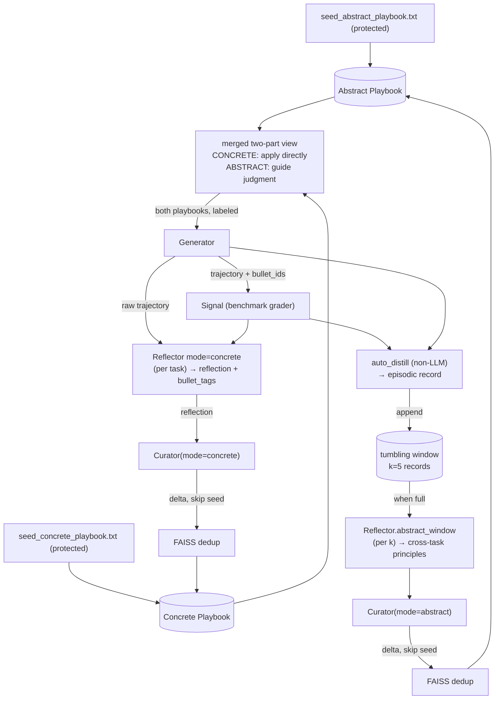

# Self-Improving Feedback Loop — v2 (dual-playbook, both-read, lean)

An abstraction-split feedback loop for the Hermes/ACE agent, built **on top of the real ACE
codebase** (`ace-agent/ace`). v2 is the leaned-down loop:

- the **Verifier is removed** (little value over the Curator's own novelty filter, one wasted call);
- the **Thompson selector is removed** — the Generator now **always reads BOTH playbooks** as a
  single labeled two-part view, with prompt framing that keeps the two used with different mindsets;
- learning is **two-timescale**: **CONCRETE is per-task** (one reflect → concrete Curator + counting),
  **ABSTRACT is per-k** — each task is distilled (non-LLM `auto_distill`) into an episodic record
  buffered in a **tumbling window of k=5**; when the window fills, ONE abstract reflect reads the k
  records for **cross-task** patterns → abstract Curator. (Per-task abstraction from a single sample
  is weak; cross-task aggregation is AEL's original semantic-memory idea.)

## What changed from v1 (`feedback_loop.md`)

| v1 | v2 |
|---|---|
| 4 agents: Generator, Reflector×2, **Verifier**, Curator×2 | **3 agents**: Generator, Reflector, Curator×2 |
| **Thompson selector** picks which one playbook the Generator reads | **Generator always reads BOTH** (labeled two-part view; no bandit) |
| Reflect(concrete) + Reflect(abstract) — two calls, **both per-task** | **concrete per-task** + **abstract per-k** (tumbling window, cross-task) |
| `auto_distill` = per-episode regex noise on prose | `auto_distill` = **GDPval-aware episodic record** (our JSON + grader missed-criteria), aggregated over k |
| Reflect → **Verifier gate** → Curate | Reflect → **Curate directly** |
| ≤6 LLM calls/task | **~3.4 LLM calls/task** (k=5) |
| seeds optional | **predefined dual seeds load by default** (concrete/abstract split sections) |
| — | **warm-start / resume**, **multi-key LiteLLM rotation** |

Redundancy control is the **Curator** ("add only NEW/complementary bullets") + the
**BulletpointAnalyzer** (FAISS dedup). Level separation is done by the merged reflector labeling
its two insight fields, the mode-specific Curator prompts, and the two-part Generator framing.

---

## 1. Object model (two playbooks)

```
ConcretePlaybook : ACE playbook   # specific, situation-tied rules (exact APIs/params/formulas/error sigs)
AbstractPlaybook : ACE playbook   # general, transferable principles

Bullet (unchanged from ACE):
  id; section; content ; metadata:{helpful,harmful}   # seed bullets are protected (never edited/removed)
```

No SelectorState — there is no bandit. Both playbooks are always read and always learn.

---

## 2. Architecture flow (modified `ace.py` loop)

```python
# STEP 0  Generator reads BOTH playbooks as one labeled two-part view     [ace._merged_playbook]
shown          = merged_view(concrete_pb, abstract_pb)    # CONCRETE (apply directly) + ABSTRACT (guide judgment)

# STEP 1  generate                                                        [core/generator.py]
gen_output     = generator.run(query, shown)              # trajectory + final answer; cites bullet_ids from EITHER part

# STEP 2  PER-TASK concrete reflect (insight + counting), → concrete Curator
c_reflect      = reflector.run(query, gen_output, used_bullets, mode="concrete")   # LLM
concrete_pb, abstract_pb = update_counts(both, c_reflect.bullet_tags)   # counting, both stores
if c_reflect: curate(concrete_pb, c_reflect, mode="concrete")

# STEP 2b DISTILL this task → episodic record; buffer it (tumbling window)
buffer.append(auto_distill(gen_output, query, feedback, signal))    # NON-LLM

# STEP 3  PER-k abstract: when the window fills, ONE reflect over the k records
if len(buffer) >= K:                                                # K = ABSTRACT_WINDOW_K (=5)
    a_reflect  = reflector.reflect_abstract_window(format_window(buffer), K)   # LLM (cross-task)
    if a_reflect.abstract_insights: curate(abstract_pb, a_reflect.abstract_insights, mode="abstract")
    buffer = []                                                     # tumbling reset

# STEP 3  curate EACH playbook from its insight                           [core/curator.py, two prompts]
if concrete_ins:
    apply_deltas(concrete_pb, curator.run(concrete_ins, concrete_pb, mode="concrete"), respect_protected=True); dedup(concrete_pb)
if abstract_ins:
    apply_deltas(abstract_pb, curator.run(abstract_ins, abstract_pb, mode="abstract"), respect_protected=True); dedup(abstract_pb)
```



Both playbooks are shown every task and learn every task from the single merged reflection:
`concrete_insight` → concrete Curator, `abstract_insight` → abstract Curator. Each Curator only
ADDs novel/complementary bullets and never touches protected seeds.

---

## 3. Two-part Generator framing (the key to "both, but not flat")

The Generator gets ONE `{playbook}` slot filled with a labeled two-part view (`_merged_playbook`):

```
########## CONCRETE PLAYBOOK — specific, situation-tied rules. APPLY DIRECTLY when a rule matches. ##########
<concrete bullets>
########## ABSTRACT PLAYBOOK — general principles & mindset. Let these GUIDE your approach (not literal steps). ##########
<abstract bullets>
```

`GENERATOR_PROMPT` explains the two mindsets so the model does NOT read both as one flat list:
- **CONCRETE** = a directly-applicable checklist; when the situation matches a rule, follow it literally.
- **ABSTRACT** = guiding judgment that shapes overall approach/strategy, not step-by-step instructions.
- Apply concrete rules when they fit; let abstract principles steer strategy and catch what no specific
  rule covers. On conflict, prefer the concrete rule for this exact situation. If only one part is
  present, use it as given.

The Generator cites `bullet_ids` from EITHER part; those cited bullets are what the counting reflect tags.

---

## 4. Components → files (current)

| # | Component | File | Role |
|---|---|---|---|
| M0 | Dual playbook + seeds + protected ids + merged view | `ace/ace.py`, `playbook_utils.py` | manage two playbooks; default-load packaged seeds; `_merged_playbook`; `respect_protected` |
| M2 | Generator | `ace/core/generator.py` + `ace/prompts/generator.py` | reads the two-part view; two-mindset framing |
| M3 | Signal | harness / benchmark grader | success/fail (telemetry only; no bandit) |
| M3.5 | **auto_distill (non-LLM)** | `ace/core/auto_distill.py` | per task → episodic record (deliverable type, score, **missed criteria**); `format_window` rolls up cross-episode repeats |
| M4a | Reflector — concrete (per task) | `ace/core/reflector.py` (`mode="concrete"`) | reflection → concrete Curator + `bullet_tags` → counting |
| M4b | Reflector — abstract window (per k) | `ace/core/reflector.py` (`reflect_abstract_window`) + `ABSTRACT_AGGREGATE_PROMPT` | reads k records → cross-task principles → abstract Curator |
| M5 | Curator ×2 | `ace/core/curator.py` + `ace/prompts/curator.py` | `mode` param; concrete / abstract prompts; skips protected seeds |
| M6 | Dedup | `ace/core/bulletpoint_analyzer.py` | one FAISS index per playbook, per curation |
| M7 | Abstract window buffer + `ABSTRACT_WINDOW_K` | `ace/ace.py` | tumbling window state; persisted for warm-start; change **k here only** |
| ~~M1~~ | ~~Playbook Selector (Thompson)~~ | **removed** | — |
| ~~M4.5~~ | ~~Verifier~~ | **removed** | — |

Packaged seeds: `ace/seeds/seed_concrete_playbook.txt`, `ace/seeds/seed_abstract_playbook.txt`.

---

## 5. Seeds (predefined, immutable, split by level)

Both stores START from a packaged seed (not an empty skeleton). Resolution order:
explicit arg > legacy `initial_playbook` (concrete only) > packaged seed file > empty split skeleton.

- **CONCRETE** sections (situation-tied): `OUTPUT FORMAT & STRUCTURE RULES`, `TOOL & API USAGE`,
  `FORMULAS & CALCULATIONS`, `CODE SNIPPETS & TEMPLATES`, `COMMON MISTAKES TO AVOID`,
  `VERIFICATION CHECKLIST`, `OTHERS`. Starter bullets: artifact-first output, structural
  fidelity, tool-free text rendering of files, API-spec-before-call, pagination, defensive
  computation, no-fabrication, pre-finalize checklist.
- **ABSTRACT** sections (transferable): `GENERAL PRINCIPLES`, `PROBLEM-SOLVING HEURISTICS`,
  `TRANSFERABLE STRATEGIES`, `FAILURE PATTERNS & RECOVERY`, `SELF VERIFICATION HABITS`,
  `OTHERS`. Starter bullets: understand-then-answer-in-required-form, deliver-the-thing,
  smallest-reversible-step, root-cause-first, decompose, separate-reasoning-from-artifact.

Section names map to clean slugs in `utils.get_section_slug` so curator-added bullets land in
the right section with the right id prefix (`fmt/api/calc/code/err/chk`, `prin/prob/strat/fail/verif`).

## 6. Reflection — two timescales

- **Concrete (per task)**: `reflector.reflect(..., mode="concrete")` → the stock reflection (fed to
  the concrete Curator) + `bullet_tags`. The tags drive helpful/harmful counting on **both** stores
  (cited bullets can be from either, since the Generator saw both). One call does insight + counting,
  like stock ACE.
- **Abstract (per k)**: each task, `auto_distill(trajectory, question, feedback, signal)` builds a
  **non-LLM episodic record** — deliverable type, pass/fail, rubric score, and the grader's **missed
  criteria** (parsed from our JSON trajectory + the grader feedback string). Records buffer in a
  tumbling window; when it reaches k, `reflector.reflect_abstract_window(format_window(buffer), k)`
  (`ABSTRACT_AGGREGATE_PROMPT`) reads the k records — `format_window` surfaces **which criteria were
  missed across MULTIPLE episodes** — and proposes only cross-task principles → abstract Curator;
  buffer resets. The window buffer is **persisted** (survives warm-start; a crash mid-window does not
  restart the k count).

## 7. Curator: split prompts, edit each playbook separately

`curator.run(..., mode=...)`:
- `CONCRETE_CURATOR_PROMPT`: "maintain SPECIFIC, situation-tied rules; preserve concrete detail."
- `ABSTRACT_CURATOR_PROMPT`: "maintain GENERAL, transferable principles; generalize/drop over-specific."

Both output stock `DeltaPatch` (ADD-only today), apply deterministically, and skip protected
(seed) bullets. "Add only NEW/complementary content" lives here — redundancy control (no verifier).

## 8. Per-task LLM budget

Per task: `Generator(1)` + concrete `Reflector(1)` (insight + counting tags) + concrete `Curator(≤1)`.
Every k=5 tasks (amortized ⅕/task): abstract `Reflector(1)` + abstract `Curator(≤1)`.
`auto_distill` is non-LLM (0). Average ≈ **~3.4 LLM calls/task** at k=5 (`3 + 2/k`). Raise k to spend
less on abstraction / learn slower; lower k for the opposite. Change k only in `ace.ABSTRACT_WINDOW_K`.

---

## 9. Harness integration + resume + key rotation

- **Adapter**: `test_benchmark/harness/agents/ace_dual_gdpval.py` — instantiates the real `ACE`
  and drives it per GDPval task (both-read → generator → rubric grader = signal → counting reflect
  → `ACE._dual_learn`). Baseline arm uses `ace_gdpval` (single playbook, `ReAct` repo); fbl arm
  uses `ace_dual_gdpval` (`ReAct_feedback_loop`). Run: `ARM=fbl LIMIT=100 bash scripts/run_gdpval_gemini.sh`
  (needs `--concurrency 1`).
- **warm-start / resume**: `_persist` writes `ace_dual_gdpval_{concrete,abstract}.txt` after each
  task; on restart `_ensure` reloads them (instead of seeds). harness `--resume` skips already-graded
  tasks (results.jsonl).
- **Key rotation** (free-tier survival): a LiteLLM proxy (`scripts/start_proxy.sh`,
  `configs/litellm_gemini.yaml`, keys in `configs/gemini_keys.env`) fronts N Gemini keys; both the
  brain (`GEMINI_BASE_URL`) and grader (`ANTHROPIC_BASE_URL`) route through it and fail over on 429.

---

## 10. Empirical results (GDPval, first 100 train tasks, gemini-3.1-flash-lite)

> Numbers are from an earlier dual-playbook run **before** the merge/auto_distill/Thompson changes.
> The Thompson-read arm meant the Generator saw only ONE playbook per task; v2 shows both, which is
> expected to help — re-run to confirm.

| | mean rubric | pass ≥0.5 | genuine 0-scores |
|---|---|---|---|
| **fbl (dual)** | **0.469** | **52** | **9** |
| baseline (single) | 0.445 | 41 | 22 |

- **fbl recovered 14 tasks baseline scored 0 on** (documents/agreements/wills/plans), no real regressions.
- **0-score driver is output MODALITY, not reasoning**: tasks demanding real spreadsheet/PDF/pptx
  files (49%) tank BOTH agents (~0.37) — a tool-free text model can't emit `.xlsx` with formulas.
- **fbl's learning shows on tractable (text) tasks**: fbl 0.572 vs baseline 0.516 (2 zeros vs 6).

Implication: to lift the file-artifact ceiling, add tool execution or stronger text-rendering of
structured data (seed `fmt-00003`); the dual-playbook loop helps wherever the deliverable is text.

---

## Summary

- **v2 = lean, two-timescale dual-playbook loop.** No Verifier, no Thompson. The Generator always
  reads BOTH playbooks as a labeled two-part view (concrete = apply directly, abstract = guide
  judgment). **Concrete learns per-task** (reflect → concrete Curator + counting); **abstract learns
  per-k** — each task is distilled (non-LLM) into an episodic record, and every k=5 tasks one abstract
  reflect over the window proposes cross-task principles → abstract Curator. ~3.4 LLM calls/task.
- **Concrete playbook** = stock ACE store; **abstract playbook** = cross-task principles, each from
  predefined level-split seeds; redundancy handled by Curator + FAISS dedup.
- **Operationally**: predefined seeds, warm-start/resume, and free-tier key rotation make long runs
  survivable.
